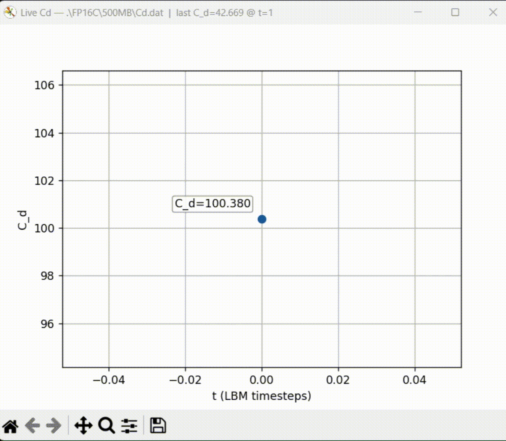
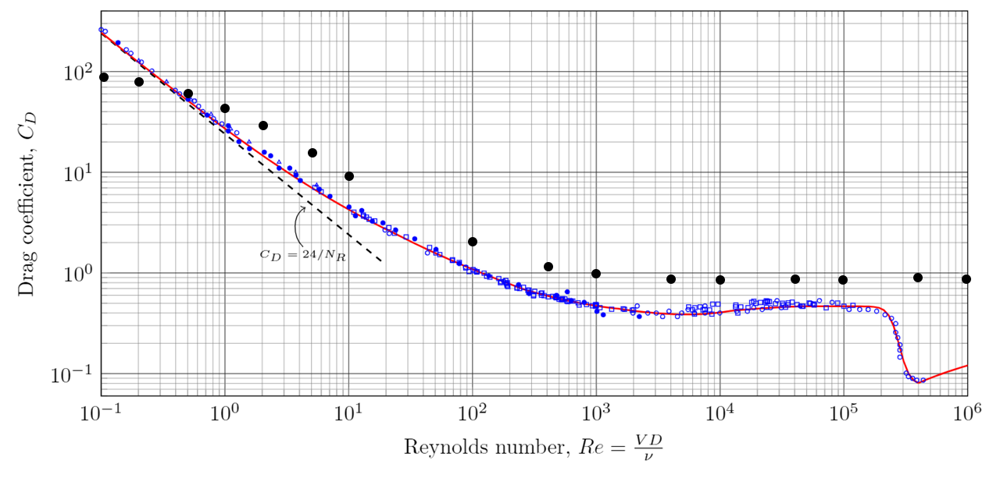

# FluidX3D-Cd-tool

Drag coefficient (**C<sub>d</sub>**) visualization & analysis helper for [FluidX3D by Dr. Moritz Lehmann](https://github.com/ProjectPhysX/FluidX3D)

---

This repository provides small helper scripts and examples to **output drag coefficients over time** from FluidX3D and **visualize / track** them during a run. It also includes a **baseline sphere case** for C<sub>d</sub> validation.

## Example (Sphere, **Re** = 10,000)

<p align="center">
  
  
</p>

Left: vortical structures visualized with the Q-criterion. Right: live monitoring of the drag coefficient C<sub>d</sub>. Both videos are shown at 10× speed.

<!--
Backup (Markdown) version of the two GIFs:


-->

## Quickstart

1) **Copy the live plotter**
   - Place `live_cd_plot.py` into the directory where your FluidX3D executable lives: `FluidX3D-master\bin\`
   - FluidX3D will write `Cd.dat` to a subdirectory (e.g., `FP16C/500MB/Cd.dat`). The plotter tails that file.

2) **Copy geometry (STL)**
   - Put STL files you plan to use in the usual place FluidX3D expects them: `FluidX3D-master\stl\`

3) **Use the sphere drag setup**
   - Replace your `void main_setup() { ... }` in `setup.cpp` with the snippet below. 
   - Run FluidX3D. As `Cd.dat` updates, run the plotter to visualize C<sub>d</sub> vs. time.

```cpp
void main_setup() { // Sphere drag; required extensions in defines.hpp: FP16C, FORCE_FIELD, EQUILIBRIUM_BOUNDARIES, SUBGRID, optionally INTERACTIVE_GRAPHICS
    // ########################## define simulation box size, viscosity and volume force ##########################
    const uint  memory  = 500u;   // available VRAM in MB (increase if you have headroom)
    const float lbm_u   = 0.05f;
    const float box_scale = 4.0f;
    const float si_u    = 0.148f;     // 0.000148 => Re ~ 10 (adjust for target Re)
    const float si_nu   = 1.48e-5f, si_rho = 1.225f;
    const float si_D    = 1.0f;
    const float PI      = 3.14159265358979323846f;
    const float si_A    = 0.25f * si_D * si_D * PI;
    const float si_T    = 2.0e13f;
    const float si_Lx   = box_scale * si_D;
    const float si_Ly   = 2.0f * box_scale * si_D;
    const float si_Lz   = box_scale * si_D;

    const uint3 lbm_N = resolution(float3(si_Lx, si_Ly, si_Lz), memory);
    units.set_m_kg_s((float)lbm_N.y, lbm_u, 1.0f, box_scale * si_D, si_u, si_rho);
    const float  lbm_nu    = units.nu(si_nu);
    const ulong  lbm_T     = units.t(si_T);
    const float  lbm_length= units.x(si_D);

    print_info("Re = " + to_string(to_uint(units.si_Re(si_D, si_u, si_nu))));
    LBM lbm(lbm_N, lbm_nu);
    info.lbm = &lbm;

    // ############################################ geometry ############################################
    Mesh* mesh = read_stl(get_exe_path() + "../stl/sphere_1000mm.stl",
                          lbm.size(), lbm.center(),
                          float3x3(float3(0, 0, 1), radians(90.0f)),
                          lbm_length);

    mesh->translate(float3(0.0f, units.x(0.5f * (0.5f * box_scale * si_D - si_D)) - mesh->pmin.y, 0.0f));
    lbm.voxelize_mesh_on_device(mesh, TYPE_S | TYPE_X);

    const uint Nx = lbm.get_Nx(), Ny = lbm.get_Ny(), Nz = lbm.get_Nz();
    parallel_for(lbm.get_N(), [&](ulong n) {
        uint x = 0u, y = 0u, z = 0u; lbm.coordinates(n, x, y, z);
        if (lbm.flags[n] != TYPE_S) lbm.u.y[n] = lbm_u;
        if (x == 0u || x == Nx - 1u || y == 0u || y == Ny - 1u || z == 0u || z == Nz - 1u) lbm.flags[n] = TYPE_E;
    });

    // ################################ visualization & run ################################
    lbm.graphics.visualization_modes = VIS_FLAG_SURFACE | VIS_FIELD;
    lbm.graphics.field_mode  = 1;
    lbm.graphics.slice_mode  = 1;

    lbm.run(0u, lbm_T); // initialize

    #if defined(FP16S)
      const string path = get_exe_path() + "FP16S/" + to_string(memory) + "MB/";
    #elif defined(FP16C)
      const string path = get_exe_path() + "FP16C/" + to_string(memory) + "MB/";
    #else
      const string path = get_exe_path() + "FP32/"  + to_string(memory) + "MB/";
    #endif

    lbm.write_status(path);
    write_file(path + "Cd.dat", "# t\tCd\n");

    const float3 lbm_com = lbm.object_center_of_mass(TYPE_S | TYPE_X);
    print_info("com = " + to_string(lbm_com.x, 2u) + ", "
                        + to_string(lbm_com.y, 2u) + ", "
                        + to_string(lbm_com.z, 2u));

    while (lbm.get_t() <= lbm_T) {
        Clock clock;
        const float3 lbm_force = lbm.object_force(TYPE_S | TYPE_X);
        const float Cd = units.si_F(lbm_force.y) / (0.5f * si_rho * sq(si_u) * si_A);
        print_info("Cd = " + to_string(Cd, 3u) + ", t = " + to_string(clock.stop(), 3u));
        write_line(path + "Cd.dat", to_string(lbm.get_t()) + "\t" + to_string(Cd, 3u) + "\n");
        lbm.run(1u, lbm_T);
    }
}
```

> **Tip**  
> Keep an eye on domain size and resolution for your target Reynolds number; under-resolution can affect C<sub>d</sub>.

## Drag coefficient sweeping over Reynolds number

### Test device (example)

| Item | Spec |
|---|---|
| **Device Name** | NVIDIA GeForce RTX 4070 Laptop GPU |
| **Vendor** | NVIDIA Corporation |
| **Driver** | 566.07 (Windows) |
| **OpenCL** | OpenCL C 3.0 |
| **Compute Units** | 36 @ 1980 MHz (4608 cores, 18.248 TFLOPs/s) |
| **Memory / Cache** | 8187 MB VRAM, 1008 KB global / 48 KB local |
| **Buffer Limits** | 2046 MB global, 64 KB constant |

### Example variables (target Re = 10,000)

| Quantity | Value |
|---|---|
| **Grid Resolution** | 158 × 315 × 158 = 7,863,660 |
| **Grid Domains** | 1 × 1 × 1 = 1 |
| **LBM Type** | D3Q19 SRT (FP32/FP16C) |
| **Memory Usage** | CPU 217 MB, GPU 1 × 508 MB |
| **Max Alloc Size** | 284 MB |
| **Time Steps** | 4662000168730624 |
| **Kinematic Viscosity** | 0.00039375 |
| **Relaxation Time** | 0.50118124 |
| **Reynolds Number** | Re < 566285 |

### Comparison (Re vs. C<sub>d</sub>)



#### Note:
- **Black dots**: measured simulation data from this tool.  
- **Blue symbols/curve**: classic sphere-drag data compiled from the literature (Maxworthy 1965; Roos & Willmarth 1971; Schlichting 1979). See **References**.
- Simulation values do not perfectly match experiments but are within the same order of magnitude and follow the general trend.  
- No drag crisis observed near **Re ≈ 10<sup>5</sup>–10<sup>6</sup>** in this baseline.  
- A **resolution study** (with a higher memory) is recommended for improved accuracy.

---

### STL files
- `sphere_1000mm.stl`: sphere with **D = 1000 mm**  
- `MosquitoSolo.stl`: free STL model from Cults3D (https://cults3d.com/en/3d-model/art/mosquito-model)  
- `Ford_GT_2017.stl`: free STL model from Thingiverse (https://www.thingiverse.com/thing:2045466)  
- `Mustang_2014.stl`: free STL model from Cults3D (https://www.thingiverse.com/thing:4978646)

> **Note 1.** Mosquito wings are static in this demo; C<sub>d</sub> reflects a fixed posture.  
> **Note 2.** Car cases generally require a ground wall (moving or stationary) and appropriate BCs.

---

### References
- Maxworthy, T. (1965). *Journal of Fluid Mechanics*. https://doi.org/10.1017/S002211206500143X  
- Roos, F. W., & Willmarth, W. W. (1971). *AIAA Journal*. https://doi.org/10.2514/3.6164  
- Schlichting, H. (1979). *Boundary-Layer Theory*. Springer. https://doi.org/10.1007/978-3-662-52919-5

---

### Acknowledgements
- FluidX3D by **Dr. Moritz Lehmann** — https://github.com/ProjectPhysX/FluidX3D
